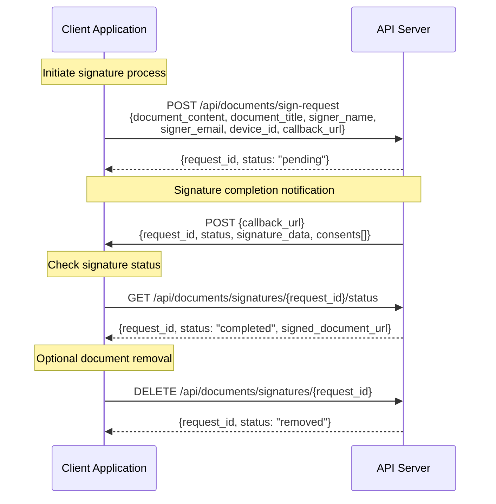
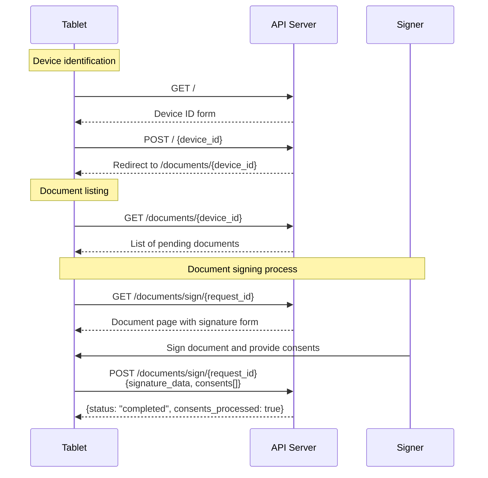

# Signature Collector

A web service for collecting electronic signatures on documents with tablet devices.

## Features

- Document signing with tablet devices
- Real-time signature capture
- Callback notifications
- Document status tracking
- Multiple consent options
- Device management

## Installation

```bash
git clone https://github.com/yourusername/signature-collector
cd signature-collector
go mod download
```

## Quick Start

1. Set up the database:

```bash
make reset
```

2. Start the development server:

```bash
make run-dev
```

The service will be available at `http://localhost:8080`

## External API Integration Flow



## Internal Tablet Flow



https://github.com/szimek/signature_pad

## API Reference

Check the [API Reference](swagger.yaml) for detailed API documentation.

## License

MIT

## Credits

Uses [Signature Pad](https://github.com/szimek/signature_pad) for signature capture.

## Authentication

The application uses two types of authentication:

1. **Basic Authentication**: This is used for web routes. The username and password are checked against the environment variables `BASEAUTH_USER` and `BASEAUTH_PASS`. If these credentials are not provided or do not match, the request is unauthorized.

2. **Token-Based Authentication**: This is used for API routes. The token is expected to be in the `Authorization` header in the format `Bearer <token>`. The token is validated against the `API_TOKEN` environment variable. If the token is not provided or does not match, the request is unauthorized.
