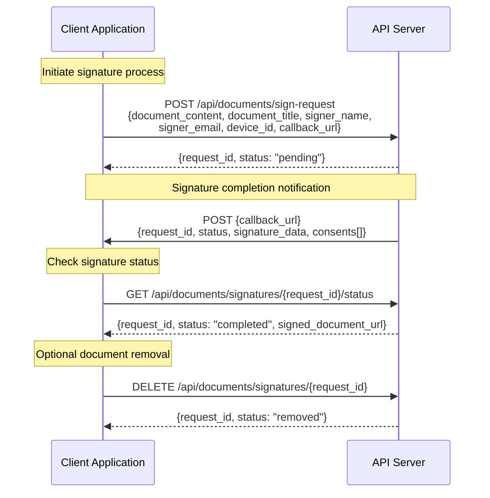
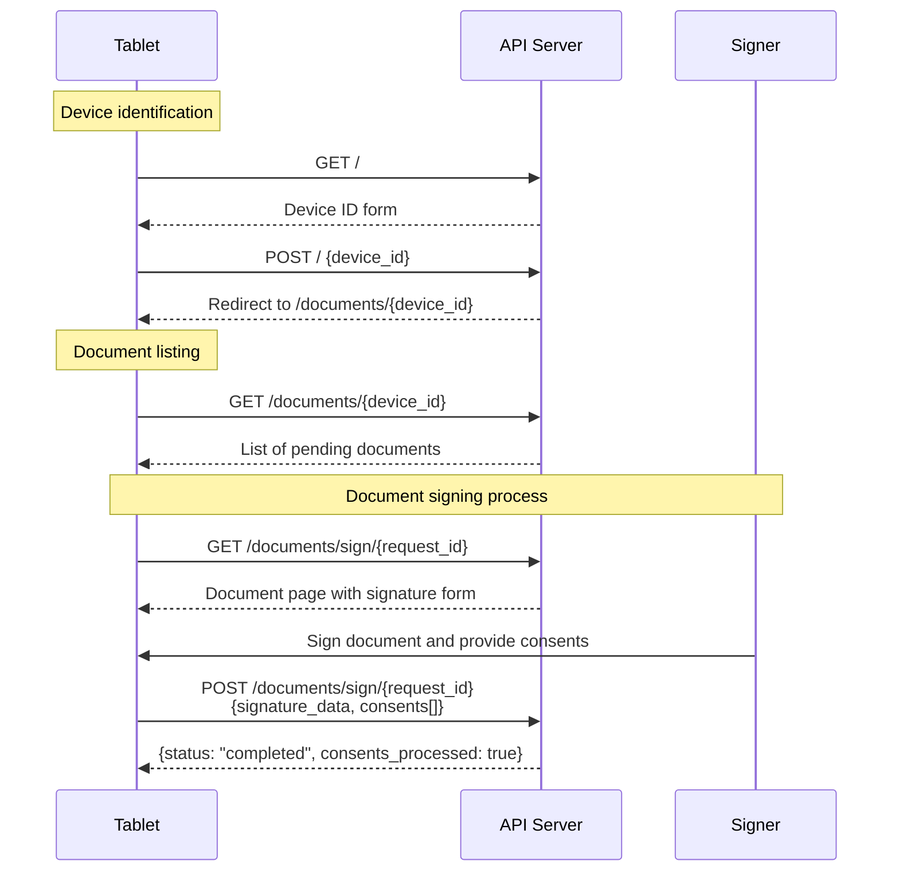

# Signature Collector

A web service for collecting electronic signatures on documents with tablet devices.

## Features

- Document signing with tablet devices
- Real-time signature capture
- Callback notifications
- Document status tracking
- Multiple consent options
- Device management

## Installation

```bash
git clone https://github.com/yourusername/signature-collector
cd signature-collector
go mod download
```

## Quick Start

1. Set up the database:

```bash
make reset
```

2. Start the development server:

```bash
make run-dev
```

The service will be available at `http://localhost:8080`

## Kiosk Mode (PWA)

The tablet UI installs as a PWA so the home-screen shortcut opens fullscreen,
with no address bar and no status bar.

Served without authentication (Chrome fetches these with credentials omitted,
and a 401 makes it drop the manifest):

- `/manifest.json` — `display: fullscreen`, `portrait-primary` (no 180° flip),
  brand colours
- `/sw.js` — minimal service worker; caches nothing, exists only because Chrome
  requires a registered worker with a `fetch` handler before it treats the app
  as installable
- `/static/icon-*.png` — 192px, 512px and a maskable 512px icon, plus
  `/static/icon.svg`; all built from the Pupilmed mark in
  `/static/logo.svg` (source: https://pupilmed.pl/logo.svg)

All of it is embedded in the binary via `go:embed`, so no extra deployment step.

Setting up a tablet:

1. Open the app in Chrome and sign in with the basic-auth credentials.
2. Add it to the home screen. If a shortcut already exists, **remove it and add
   it again** — Chrome does not update the display mode of existing shortcuts.
3. Launch from the shortcut and check that a signature stroke on the canvas is
   not swallowed as a scroll gesture.

Orientation is pinned twice: `portrait-primary` in the manifest (honoured by
Chrome when launched from the shortcut) and a `screen.orientation.lock()` call
in the layout, re-applied when the app returns to the foreground. In a plain
browser tab the lock rejects and is ignored — there is nothing to enforce
outside fullscreen/standalone. iOS Safari honours neither.

## External API Integration Flow


```mermaid
sequenceDiagram
    participant Client as Client Application
    participant API as API Server

    Note over Client: Initiate signature process
    Client->>API: POST /api/documents/sign-request<br/>{document_content, document_title, signer_name,<br/>signer_email, device_id, callback_url}
    API-->>Client: {request_id, status: "pending"}

    Note over API,Client: Signature completion notification
    API->>Client: POST {callback_url}<br/>{request_id, status, signature_data, consents[]}

    Note over Client: Check signature status
    Client->>API: GET /api/documents/signatures/{request_id}/status
    API-->>Client: {request_id, status: "completed", signed_document_url}

    Note over Client: Optional document removal
    Client->>API: DELETE /api/documents/signatures/{request_id}
    API-->>Client: {request_id, status: "removed"}
```

## Internal Tablet Flow


```mermaid
sequenceDiagram
    participant Tablet
    participant API as API Server
    participant Signer

    Note over Tablet: Device identification
    Tablet->>API: GET /
    API-->>Tablet: Device ID form
    Tablet->>API: POST / {device_id}
    API-->>Tablet: Redirect to /documents/{device_id}

    Note over Tablet: Document listing
    Tablet->>API: GET /documents/{device_id}
    API-->>Tablet: List of pending documents

    Note over Signer,Tablet: Document signing process
    Tablet->>API: GET /documents/sign/{request_id}
    API-->>Tablet: Document page with signature form
    Signer->>Tablet: Sign document and provide consents
    Tablet->>API: POST /documents/sign/{request_id}<br/>{signature_data, consents[]}
    API-->>Tablet: {status: "completed", consents_processed: true}
```

https://github.com/szimek/signature_pad

## API Reference

Check the [API Reference](swagger.yaml) for detailed API documentation.

## License

MIT

## Credits

Uses [Signature Pad](https://github.com/szimek/signature_pad) for signature capture.

## Authentication

The application uses two types of authentication:

1. **Basic Authentication**: This is used for web routes. The username and password are checked against the environment variables `BASEAUTH_USER` and `BASEAUTH_PASS`. If these credentials are not provided or do not match, the request is unauthorized.

2. **Token-Based Authentication**: This is used for API routes. The token is expected to be in the `Authorization` header in the format `Bearer <token>`. The token is validated against the `API_TOKEN` environment variable. If the token is not provided or does not match, the request is unauthorized.
